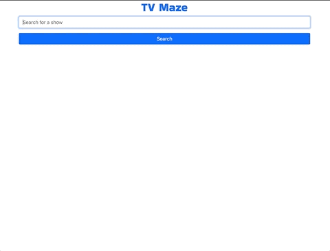

# TV Maze

## **Live Website**

### 👉[Click here to open website](https://cng008.github.io/14.3_AJAX-apis-tvmaze/)

---

## **Purpose and Features**

- To understand and finish a partially-complete web app for study purposes.

### **Overview**

Jeopardy! is one of the longest-running game shows in American history. It has been running for 36 years, and contestants have earned millions of dollars since it first aired. Ken Jennings alone won 2.5 million dollars on his historic 74 game hot streak. For trivia nerds out there, it is possibly the best game show ever created.

---

### **Features**

- An interactive front-end interface for users to search shows in the [TVMaze API](https://www.tvmaze.com/api) database
- Search all shows that match the searched keyword
- “Episodes” button at the bottom of each show card displays all episodes for the show when clicked

---

## **API**

This application was created using data from the <ins>**[TVMaze API](https://www.tvmaze.com/api)**</ins>. All shows are sourced from the API's database.

---

## **Technologies**

This project was made using the following technologies:

- [Javascript](https://www.javascript.com)
- [Axios](https://axios-http.com/docs/intro)
- [HTML](https://developer.mozilla.org/en-US/docs/Web/HTML)
- [Bootstrap 5](https://getbootstrap.com/docs/5.1/getting-started/introduction/)
- [VSCode](https://code.visualstudio.com/docs)
