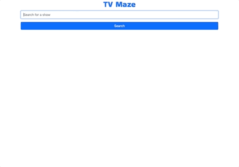

# TV Maze

## **Live Website**

### 👉[Click here to open website](https://cng008.github.io/14.3_AJAX-apis-tvmaze/)

---

## **Purpose**

- To understand and finish a partially-complete web app for study purposes.

---

### **Features**

- An interactive front-end interface for users to search shows in the [TVMaze API](https://www.tvmaze.com/api) database
- Search all shows that match the searched keyword
- “Episodes” button at the bottom of each show card displays all episodes for the show when clicked

---

## **API**

This application was created using data from the <ins>**[TVMaze API](https://www.tvmaze.com/api)**</ins>. All shows are sourced from the API's database.

---

## **Technologies**

This project was made using the following technologies:

- [Javascript](https://www.javascript.com)
- [Axios](https://axios-http.com/docs/intro)
- [HTML](https://developer.mozilla.org/en-US/docs/Web/HTML)
- [Bootstrap 5](https://getbootstrap.com/docs/5.1/getting-started/introduction/)
- [VSCode](https://code.visualstudio.com/docs)
